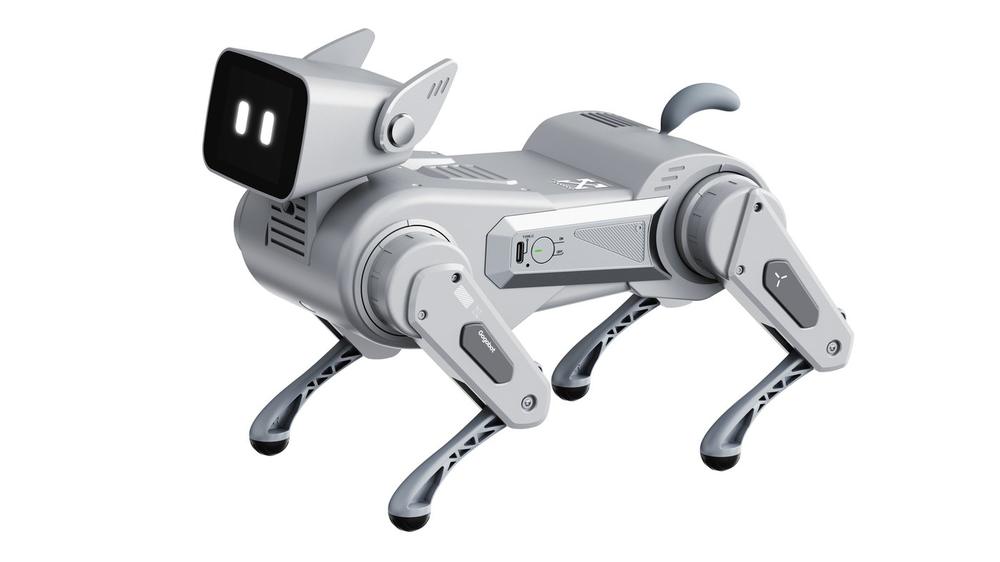

# Gogobot EDU SDK for C++

[English](README.md) | [中文](README.zh_CN.md)


Windows-first C++ SDK for the **Changba AI-Dog / Gogobot EDU** quadruped robot. It provides a direct C++ API for classroom programming, BLE robot control, action choreography, sensor streaming, Dev PC WebSocket control, and bidirectional PCM audio workflows.



## Highlights

- Windows BLE scan, connect, command, and notification handling.
- High-level actions, ears, expressions, tones, volume, and movement control.
- IMU and TOF sensor streaming through BLE notifications.
- Dev PC WebSocket host for LAN control, sensor JSON, and bidirectional PCM audio.
- Smooth pose, foot, and joint adjustment APIs for advanced choreography.
- Win32 upper-computer tools for BLE and WebSocket operation.
- Focused examples for teachers, students, labs, and course platforms.

## Requirements

- Windows 10/11
- Visual Studio 2022 Build Tools or Visual Studio 2022 with MSVC
- CMake >= 3.21
- BLE-capable Windows PC for Bluetooth examples and tools
- Network connection between the PC and robot for WebSocket examples

WebSocket dependencies are fetched by CMake when `AIDOG_ENABLE_WEBSOCKET=ON`.

## Build

Use a Windows Developer PowerShell or Developer Command Prompt:

```powershell
cd C:\C_project_3.1\arbitrarion10\aidog_sdk_cpp
cmake -S . -B build -G "Visual Studio 17 2022" -A x64
cmake --build build --config Release
ctest --test-dir build -C Release --output-on-failure
```

If `cmake` is not found, open a new terminal after installing CMake or use the full path:

```powershell
& "C:\Program Files\CMake\bin\cmake.exe" --version
```

Protocol-only builds can disable BLE and WebSocket:

```powershell
cmake -S . -B build-protocol -G "Visual Studio 17 2022" -A x64 -DAIDOG_ENABLE_WINDOWS_BLE=OFF -DAIDOG_ENABLE_WEBSOCKET=OFF -DAIDOG_BUILD_EXAMPLES=OFF
cmake --build build-protocol --config Release
ctest --test-dir build-protocol -C Release --output-on-failure
```

## Quick Start

```cpp
#include <aidog.hpp>

int main()
{
    aidog::AiDog dog;

    aidog::ConnectOptions options;
    options.address = "12:0A:AB:16:3A:04";
    dog.connect(options);

    dog.send_interaction(aidog::Action::SitDown);
    dog.start_movement(aidog::Movement::Forward);
    dog.stop_movement();

    dog.send_ear(aidog::EarAction::EarStandLeft);
    dog.send_expression(aidog::ExpressionAction::Happy01);
    dog.send_audio(aidog::Tone::Jeez);
    dog.set_volume(3);

    dog.disconnect();
}
```

## WebSocket Control

The robot connects to a Dev PC WebSocket host running on the computer. When the PC IP changes, write the new Dev-PC WebSocket IP through BLE first:

```powershell
.\build\Release\aidog_set_dev_pc_ws_ip_ble.exe --address 12:0A:AB:16:3A:04 192.168.11.101
```

Then run a WebSocket host example or the WebSocket control panel:

```powershell
.\build\Release\aidog_ws_connection_test.exe --timeout 120 --no-keep-alive
.\build\Release\aidog_user_control_ws.exe
```

C++ APIs that accept a transport string can use `"ws"` after a `WebSocketHost` is attached:

```cpp
aidog::AiDog dog;
aidog::WebSocketHost host("0.0.0.0", 8766, &dog);
host.start();
host.wait_robot_connected(120.0);

dog.send_audio(aidog::Tone::Jeez, "ws");
dog.send_interaction(aidog::Action::ShakeHand, std::nullopt, "ws");
dog.start_movement(aidog::Movement::Forward, "ws");
dog.stop_movement("ws");
```

## Examples

| File | Purpose | Risk |
|---|---|---|
| `examples/01_connection/bluetooth/ble_scan_and_connect.cpp` | Scan, list devices, and connect by BLE | Low |
| `examples/01_connection/websocket/ws_connection_test.cpp` | Wait for the robot to connect to the PC WebSocket host | Low |
| `examples/02_actions/bluetooth/ble_basic_actions.cpp` | Run one high-level BLE action | Medium |
| `examples/02_actions/websocket/ws_basic_actions.cpp` | Run one high-level WebSocket action | Medium |
| `examples/02_actions/bluetooth/ble_ears_expressions_audio.cpp` | Ears, expressions, tones, volume, and special detection over BLE | Low/Medium |
| `examples/02_actions/websocket/ws_ears_expressions_audio.cpp` | Ears, expressions, tones, and volume over WebSocket | Low/Medium |
| `examples/03_movement/bluetooth/ble_directional_move.cpp` | Directional movement over BLE | Medium |
| `examples/03_movement/websocket/ws_directional_move.cpp` | Directional movement over WebSocket | Medium |
| `examples/04_sensors/bluetooth/ble_imu_read.cpp` | Subscribe to BLE IMU data | Low |
| `examples/04_sensors/websocket/ws_imu_lan_read.cpp` | Receive IMU data over LAN WebSocket | Low |
| `examples/05_audio/bidirectional_pcm_ws_host.cpp` | Bidirectional PCM WebSocket audio host | Low |
| `examples/06_robot_adjust/safe_pose_adjust.cpp` | Smooth pose / foot / joint adjustment | High |

Full example index: [Examples](examples/README.md).

## Tools

Windows BLE upper-computer control panel:

```powershell
.\build\Release\aidog_user_control_ble.exe
```

Windows WebSocket upper-computer control panel:

```powershell
.\build\Release\aidog_user_control_ws.exe
```

Dev-PC WebSocket IP writer:

```powershell
.\build\Release\aidog_set_dev_pc_ws_ip_ble.exe --address 12:0A:AB:16:3A:04 192.168.11.101
```

## Documentation

- [Examples](examples/README.md)
- [C++ SDK Design Notes](docs/2026-06-15-aidog-sdk-cpp-design.md)

## Project Layout

```text
aidog_sdk_cpp/
  include/                  # Public C++ headers
  src/                      # SDK implementation
  examples/                 # Runnable C++ examples
  tools/                    # Windows upper-computer tools
  tests/                    # Protocol and parser tests
  docs/                     # Design notes and future user docs
  CMakeLists.txt            # CMake build entry
  README.md                 # English entry
  README.zh_CN.md           # Chinese entry
```

## License

Apache-2.0. See [LICENSE](LICENSE).
