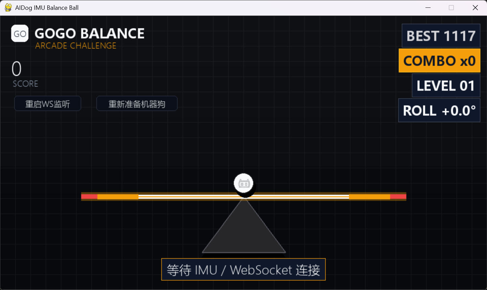

# Mini Games

The Python SDK contains PC-side pygame mini games that use keyboard, BLE IMU, or WebSocket IMU input. The C++ SDK does not currently include independent game executables, but it exposes the same BLE and WebSocket IMU data paths needed to build equivalent C++ demos.

## Python Reference Games

| Game | Python entry script | Control modes | Notes |
| --- | --- | --- | --- |
| Balance Ball | `../../aidog_sdk/game/balance_ball/aidog_balance_ball_game.py` | Keyboard, BLE IMU, WebSocket IMU | Keep the ball balanced by tilting the robot. |
| Brick Breaker | `../../aidog_sdk/game/brick_breaker/aidog_brick_breaker_game.py` | Keyboard, BLE IMU, WebSocket IMU | Move the paddle with robot roll and clear all bricks. |
| Space Fighter | `../../aidog_sdk/game/space_fighter/aidog_space_fighter_game.py` | Keyboard, WebSocket IMU | Move the fighter, defeat waves, and clear boss stages. |

## Screenshots

### Balance Ball

<p align="center">
  
</p>

### Brick Breaker

<p align="center">
  
</p>

### Space Fighter

<p align="center">
  
</p>

## C++ Sensor Inputs for Games

BLE IMU:

```powershell
.\build\Release\aidog_ble_imu_read.exe --address 12:0A:AB:16:3A:04 --hz 20 --seconds 10
```

WebSocket IMU:

```powershell
.\build\Release\aidog_ws_imu_lan_read.exe --bind 0.0.0.0 --port 8766 --hz 20 --seconds 10 --connect-timeout 120
```

C++ callback style:

```cpp
dog.add_imu_listener([](const aidog::ImuData& imu) {
    // Use imu.rollDeg or imu.pitchDeg as game input.
});
```

## Recommended C++ Game Direction

For a future C++ version, keep the game loop separate from robot transport:

- A BLE or WS input adapter reads `ImuData`.
- The game consumes normalized roll / pitch values.
- Robot feedback such as audio, ears, and expressions is optional and rate-limited.

## Safety

- Keyboard mode is always the safest first trial.
- For robot IMU control, place the robot on a stable surface and avoid touching the legs while it is moving.
- Do not run movement commands from a game loop until the input and stop behavior are tested.
